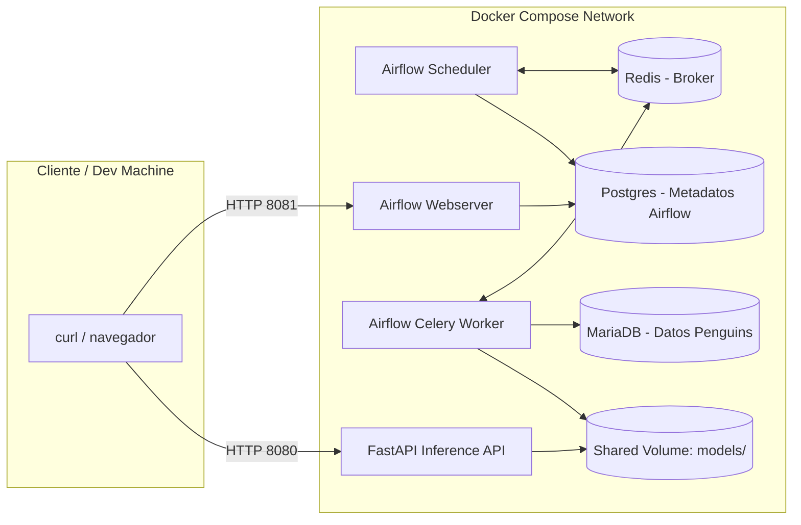
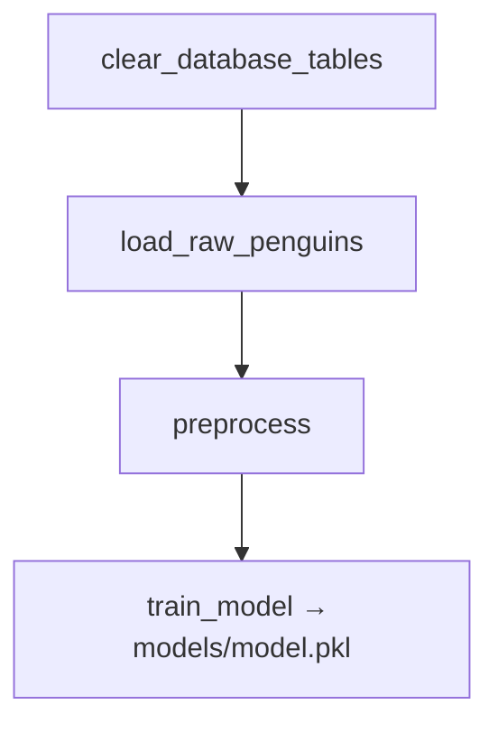

# Taller: Orquestación de un Pipeline de ML con Airflow, MariaDB, Docker y FastAPI

> **Objetivo:** Construir un pipeline de ML end-to-end (ETL → Preprocesamiento → Entrenamiento → Serving) orquestado con **Apache Airflow**, almacenando datos en **MariaDB**, y exponiendo el modelo con **FastAPI**, todo dentro de **Docker Compose**.

---

##  Diagrama de arquitectura (alto nivel)



---

## 🧮 Flujo del DAG



**Tareas**
- `clear_database_tables`: limpia tablas `penguins_raw` y `penguins_prepared` en MariaDB.
- `load_raw_penguins`: descarga `penguins.csv` y lo inserta en `penguins_raw` (manejo de `NaN → NULL`).  
- `preprocess`: limpia/ensambla y guarda `penguins_prepared`.
- `train_model`: entrena `RandomForest` con un `Pipeline` (OneHotEncoder + StandardScaler), guarda `models/model.pkl`.

---

## 🔌 Endpoints de la API (FastAPI)

- **Docs**: `http://localhost:8080/docs`
- **Health**: `GET /`
- **Inferencia**: `POST /predict`

**Ejemplo de request**
```bash
curl -X POST http://localhost:8080/predict \
  -H 'Content-Type: application/json' \
  -d '{
        "island":"Torgersen",
        "bill_length_mm":39.1,
        "bill_depth_mm":18.7,
        "flipper_length_mm":181,
        "body_mass_g":3750,
        "sex":"Male"
      }'
```

---

## 📦 Estructura del proyecto

```
penguins-airflow/
├─ .env
├─ docker-compose.yml
├─ Makefile
├─ README.md   ← este archivo
├─ airflow/
│  ├─ Dockerfile
│  ├─ requirements.txt
│  └─ dags/
│     └─ penguins_pipeline.py
├─ api/
│  ├─ Dockerfile
│  └─ main.py
└─ models/     # artefactos del modelo (model.pkl)
```

---

## ▶️ Puesta en marcha (paso a paso)

> Requisitos: Docker y Docker Compose v2. Puertos libres: 8081 (Airflow), 5555 (Flower), 8080 (API), 5432, 3306, 6379.

1) **Permisos de volúmenes** (evita `PermissionError` al guardar `model.pkl`):
```bash
mkdir -p airflow/dags airflow/logs models
sudo chown -R $(id -u):0 airflow models
sudo chmod -R g+rwX airflow models
```

2) **Construir imágenes**:
```bash
make build
```

3) **Inicializar Airflow** (migraciones + usuario admin):
```bash
make init
```

4) **Levantar todo el stack**:
```bash
make up
```

5) **Abrir UIs:**
- Airflow → http://localhost:8081  (admin / admin)
- Flower  → http://localhost:5555
- API     → http://localhost:8080

---

## 🧪 Ejecución del taller

### Parte 1 — Ejecutar el DAG
1. En Airflow UI, habilita y ejecuta `penguins_etl_train`.
2. Verifica artefacto:
   ```bash
   ls -l models/
   # Debe existir: model.pkl
   ```

### Parte 2 — Probar la API
1. Health:
   ```bash
   curl http://localhost:8080/
   ```
2. Predicción (ejemplo de arriba).

### Parte 3 — Consultas en MariaDB (opcional)
```bash
docker compose exec penguins-db mariadb -upenguins -ppenguins -D penguins \
  -e "SHOW TABLES; SELECT COUNT(*) AS raw_rows FROM penguins_raw; SELECT COUNT(*) AS prepped_rows FROM penguins_prepared;"
```

---

## 🧑‍💻 Ejercicios guiados

1. **Feature Engineering**  
   - Agrega una nueva columna derivada en `preprocess` (ej. `bill_ratio = bill_length_mm / bill_depth_mm`).
   - Reentrena y compara `accuracy` en los logs de `train_model`.

2. **Cambiar modelo**  
   - Sustituye `RandomForestClassifier` por `XGBClassifier` o `LogisticRegression`.  
   - Ajusta hiperparámetros y mide el impacto.

3. **Validación**  
   - Añade `cross_val_score` y guarda métricas adicionales en el `meta` del `model.pkl`.

4. **Programación**  
   - Cambia `schedule_interval` del DAG para ejecuciones horarias y crea un SLA.

5. **Observabilidad**  
   - Abre **Flower** para ver workers y colas Celery.  
   - Añade `Logging` detallado en cada tarea.

---

## 🛠️ Troubleshooting (FAQ)

- **`Type annotation ... Mapped[]` / SQLAlchemy**  
  No forzar SQLAlchemy 2.x en Airflow 2.9.x. Usa `SQLAlchemy<2.0` o PyMySQL directo (este proyecto usa PyMySQL en el DAG).

- **`nan can not be used with MySQL`**  
  Convierte `NaN` a `None` antes de `executemany`:
  ```python
  df = df.astype(object).where(~pd.isna(df), None)
  ```

- **`PermissionError: /opt/airflow/models/model.pkl`**  
  Ajusta permisos de `models/` como en la sección de puesta en marcha.

- **API no responde en 8080**  
  - Revisa estado: `docker compose ps`  
  - Logs: `docker compose logs --tail=200 api`  
  - Si falta el modelo, la API queda arriba (lazy-load) pero `/predict` devolverá 503 hasta que corras el DAG.

---

## 📘 Referencias útiles
- Airflow Docker Image & Constraints: https://airflow.apache.org/docs/docker-stack/
- FastAPI: https://fastapi.tiangolo.com/
- Seaborn Penguins Dataset: https://github.com/mwaskom/seaborn-data

---

## ✅ Resultado esperado
Al finalizar, tendrás:
- Un **DAG funcional** que carga, prepara y entrena un modelo.  
- Un **modelo versionado** en `models/model.pkl`.  
- Una **API** que sirve predicciones con `/predict`.  
- Un **stack reproducible** con Docker Compose para repetir, extender y enseñar este taller.
